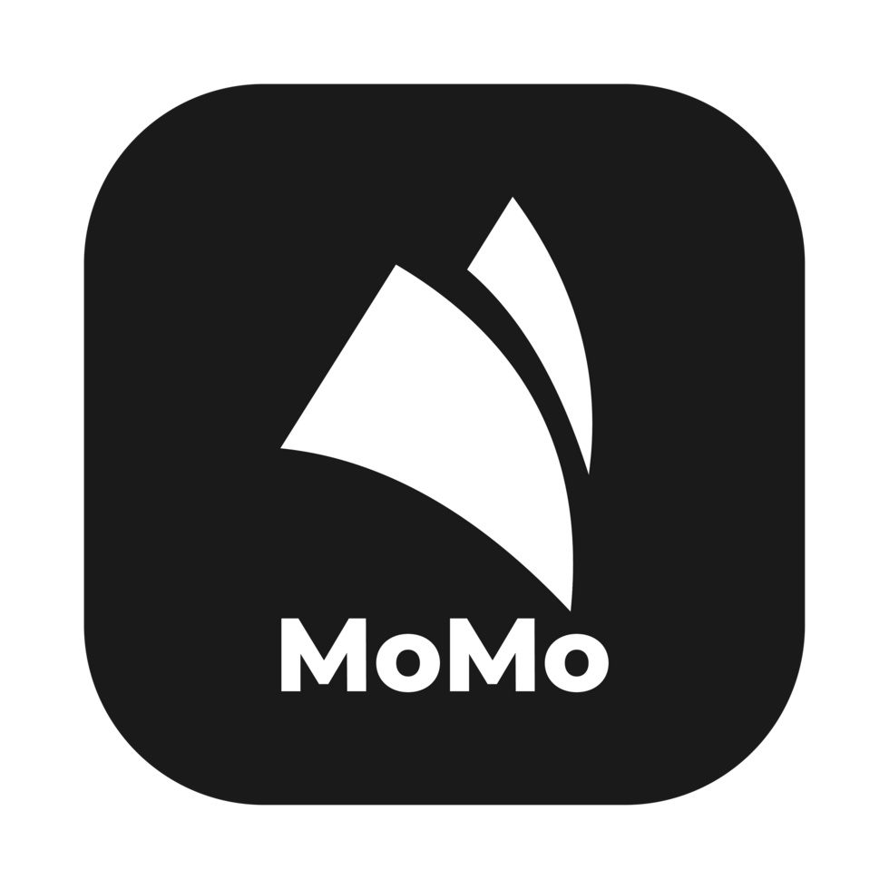
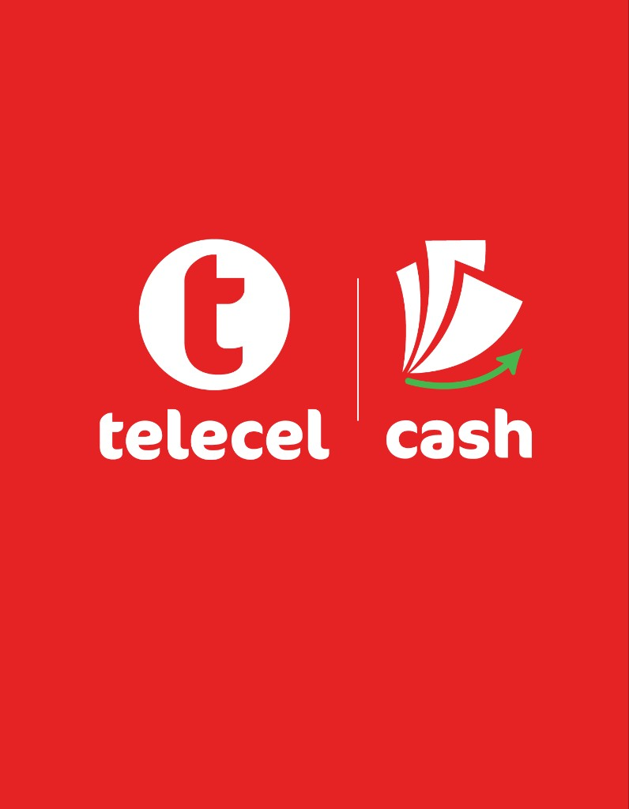

<div align="center">


# PayAsYouGo

**Campus rides. Instant MoMo. Zero cash friction.**

A mobile transport payment app for **University of Cape Coast (UCC)** — passengers pay fixed campus fares with Mobile Money; drivers get paid into a live wallet.

<br />


<br />


&nbsp;&nbsp;


<sub>Pay with **MTN MoMo** or **Telecel Cash** via Paystack</sub>

</div>

---

## ✨ What it does

<table>
<tr>
<td width="50%" valign="top">

### 🧳 Passengers
- Sign up / log in (JWT + optional Google)
- Pick campus **From → To** with live fares
- Link a driver by **Driver ID**
- Pay MoMo (MTN / Telecel)
- Rate the driver after payment
- Trip history & profile photo

</td>
<td width="50%" valign="top">

### 🚕 Drivers
- Unique **Driver ID** + QR code for passengers
- Live wallet, today’s earnings & MoMo withdrawals
- Trip / payment history
- Profile with vehicle + rating
- Ratings update from passenger feedback

</td>
</tr>
</table>

---

## 🧱 Stack

| Layer | Tech |
|:------|:-----|
| 📱 App | React Native · Expo ~54 · TypeScript |
| 🧭 Nav | React Navigation (tabs + stacks) · floating tab bar |
| 🔐 Session | SecureStore JWT · React Context |
| 🖥️ API | Node.js · Express · Prisma |
| 🗄️ DB | Neon PostgreSQL |
| 💳 Payments | Paystack Mobile Money (GHS) |

---

## 🚀 Quick start

### Prerequisites

- Node.js **18+** & npm  
- [Expo Go](https://expo.dev/go)  
- [Neon](https://console.neon.tech) Postgres project  
- [Paystack](https://dashboard.paystack.com) **test** API keys  

### 1 · Install

```bash
git clone <repository-url>
cd payasyougo
npm install
cd backend && npm install && cd ..
```

### 2 · Backend

Follow **[backend/README.md](./backend/README.md)** (Neon + Paystack + migrate + seed), then:

```bash
cd backend
npm run dev
```

API health: `GET http://localhost:4000/health`

### 3 · App env

Root `.env` (from `.env.example`):

```env
EXPO_PUBLIC_API_URL=http://YOUR_LAN_IP:4000
EXPO_PUBLIC_MOCK_MODE=false
```

> 💡 Use your Mac’s **LAN IP** (not `localhost`) when testing on a physical phone.

### 4 · Run Expo

```bash
npx expo start
```

Scan the QR with Expo Go (same Wi‑Fi as the API).

---

## 💳 Paystack MoMo (important)

Payments use Paystack’s **charge** API. The app collects:

| Field | Why |
|:------|:----|
| Network (MTN / Telecel) | Maps to Paystack `mtn` / `vod` |
| MoMo phone number | Where the payment prompt is sent |

Receipt details (route, amount, driver, reference) come from **your database** after Paystack confirms — not from that phone field alone.

### 🧪 Test mode

With `sk_test_…` keys, **real phone numbers are declined**. Use Paystack’s official test number:

| Network | Test number | Notes |
|:--------|:------------|:------|
| **MTN** | `0551234987` | No PIN / OTP in test |
| **Telecel** | — | Paystack does **not** publish a Telecel/Vodafone sandbox number. Telecel cannot be end-to-end tested on test keys. |

```text
Declined. Please use the test mobile money number
since you are doing a test transaction.
```

↑ That error means you’re on test keys with a live number — switch to `0551234987` (MTN tile).

### Going live later

1. Switch to Paystack **live** keys  
2. Use real passenger MoMo numbers (MTN **or** Telecel Cash)  
3. Enable Ghana MoMo (GHS) on the Paystack business  
4. Optionally set a webhook: `POST /api/payments/webhook`  
   (the app also **polls** payment status, so local testing works without ngrok)

In **live / production**, Telecel works the same as MTN: the app sends provider `vod` to Paystack, and the passenger approves on their real Telecel Cash number. No special sandbox workaround is needed once live keys are enabled.

---

## 👤 Seeded test accounts

| Role | Name | Phone | Password | Driver ID |
|:-----|:-----|:------|:---------|:----------|
| Passenger | Admin Passenger | `0550000111` | `admin123` | — |
| Driver | Kwame Owusu | `0240000001` | `driver123` | `DRV001` |
| Driver | Ama Asantewaa | `0200000002` | `driver456` | `DRV002` |
| Driver | Kwame Asiamah | `0240000111` | `admin123` | `DRV100` |

All three drivers are created by `prisma/seed.ts` (re-run after a fresh Neon DB).

Drivers can show a **QR code** from the dashboard. Passengers scan it on **Link driver** instead of typing the ID.

```bash
cd backend && npm run prisma:seed
```

### Google sign-in (passengers)

1. Create OAuth clients in [Google Cloud Console](https://console.cloud.google.com/apis/credentials)  
2. Root `.env`:
   ```env
   EXPO_PUBLIC_GOOGLE_WEB_CLIENT_ID=...
   EXPO_PUBLIC_GOOGLE_IOS_CLIENT_ID=...
   EXPO_PUBLIC_GOOGLE_ANDROID_CLIENT_ID=...
   ```
3. Same IDs in `backend/.env` as `GOOGLE_*_CLIENT_ID`  
4. Restart API + Expo  

---

## 📁 Project layout

```text
payasyougo/
├── 📱 App.tsx / app.json
├── 🖼️ assets/brand/          # logo, MoMo & Telecel marks
├── 🖥️ backend/
│   ├── prisma/               # schema · migrations · seed
│   └── src/                  # Express · Paystack · auth
├── 📂 src/
│   ├── components/           # DriverCard, RouteSelector, …
│   ├── navigation/           # Floating tab bar + stacks
│   ├── screens/              # passenger · driver · shared
│   ├── services/             # API · payments · auth
│   └── theme/                # colors · typography
└── 📚 docs/
```

---

## 🗺️ Campus routes

Fares live in Neon (seeded). Stops include Science, Casford, Ayensu, Valco, Amissah Arthur, KNH, and more — **bidirectional** pairs where configured.

Full reference → [docs/ROUTES.md](./docs/ROUTES.md)

---

## 📚 Docs

| Doc | About |
|:----|:------|
| [Overview](./docs/OVERVIEW.md) | Background & scope |
| [Architecture](./docs/ARCHITECTURE.md) | System design |
| [Data Models](./docs/DATA_MODELS.md) | Users, trips, routes |
| [Navigation](./docs/NAVIGATION.md) | Screen flows |
| [Backend](./docs/BACKEND.md) | API design |
| [Environment](./docs/ENVIRONMENT.md) | Env vars |
| [Deployment](./docs/DEPLOYMENT.md) | Ship checklist |
| [User Manual](./docs/USER_MANUAL.md) | How to use the app |

---

## 👥 Authors

**University of Cape Coast** — Department of Computer Science and Information Technology

- Gyebi Obed Bediako  
- Oppong Emmanuel  
- Rockson Mensah  
- Shamsudeen N.A Osekre  
- Mohammed Richmond Yaw  

**Supervisor:** Mr. Sandro Amofa  

---

## 📄 License

See [LICENSE](./LICENSE).

<div align="center">
<br />

<br />
<sub>PayAsYouGo · UCC campus MoMo</sub>
</div>
